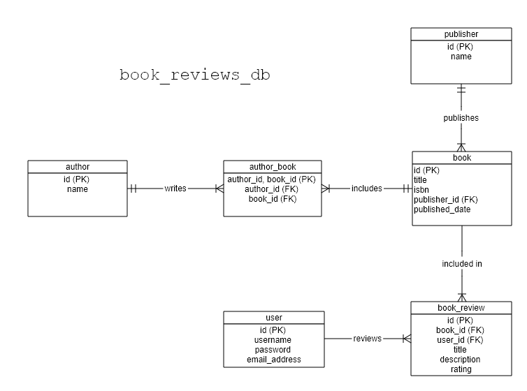
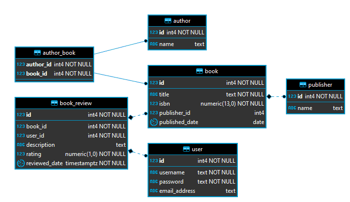

# Let's create a Book Review database using RDS :books:

> Source: https://medium.com/swlh/the-best-parts-of-the-pragmatic-programmer-86588f9e0573

## Prologue
This quick guide aims to bootstrap your familiarity with **Amazon RDS** by providing a fully-functional yet simple schema with initial dataset that you can extend further upon working your instances. Who knows, you might want to do the ff:
  1. Add more data on top and reuse the existing `SELECT` statement designed for a simple real life use case to **evaluate DB performance**.
  1. Implement a `CRUD model` and front-end to essentially **build your very own standard three-tier architecture app**.
  1. **Analyze performance from heavy I/O operations** via `CloudWatch`, `Enhanced Monitoring`, and `Performance Insights`. 

## Setting up
We're using the following:
  1. **Amazon RDS** using `Postgres 12` :elephant:
  1. Any SQL client that supports Postgres such as [DBeaver](https://dbeaver.io/), [Sqlelectron](https://sqlectron.github.io/), or yours truly [pgAdmin](https://www.pgadmin.org/)
  1. SQL files to initialize schema and data to your instances in [./rds/*](https://github.com/maronavenue/aws-learning-path/tree/main/rds)

## The database structure

### Design
We'll create a simple schema that stores basic information about the books as well as users who can submit reviews about them. Here are the **semantic rules** for our "non-existent" `book reviews application`:
  1. A `book` must contain one or more `authors`, but can only contain one `publisher`.
  1. An `author` must have at least one `book` to exist.
  1. A `publisher` can exist without a `book`.
  1. A `user` can have zero or more `book_reviews` regardless if they're the same exact `book`.

### Entity-Relationship Diagram
Now that we have some starting grounds, please refer to the following ERDs to better visualize the database model and illustrate the key relationships:

#### The Logical ERD

I intended to manually create a Conceptual model, but it ended up being closer to Logical-ish. Some notes:
  * All tables are normalized in **3NF** since there are no tables that have non-prime attributes containing **partial and transitive functional dependencies** on any candidate keys.
  * And **BCNF** for that matter is automatically guaranteed because there are no overlapping candidate keys in each table which could cause **trivial functional dependencies** if there happens to be determinants that aren't candidate keys themselves, `i.e. the dependent attribute isn't a subset.`
  * In any case, we used a **junction table** for the associative relationship between `book` and `author` (*Many-to-Many*).
  * The `publisher` and `book` also share a *One-to-Many* cardinal relationship by virtue of the `FOREIGN KEY` in the latter table.
  * Pay attention to `book_review` as it isn't necessarily a **junction_table** but an non-associative entity of itself which respects **semantic rule #4** because we want to allow the same `user` to review the same `book` repeatedly.

#### The Physical ERD

This was generated automatically using **DBeaver** and provides a more verbose look including data types. It's great because it also shows **identifying** and **non-identifying** relationships through the straight and dotted lines respectively. Some interesting points:
  * Notice the contrast between `author_book` and `book_review` in which the former has an identifying relationship with the parents (`author` and `book`) since its existence depends on their rows, whereas the latter has a non-identifying relationship — **that isn't true**, because we made the `FOREIGN KEY` to be `NOT NULL`. Therefore, this table ceases to exist (or have meaning) if the books being reviewed or the reviewers were erased. I believe this is just due to the dry logic in determining the graphic through said contraints.
  * It can also be observed that we didn't implement the **ordinality** based on the ERD because it will make our DDL file more complicated than it has to be and several of those might be better off implemented in the application side, `i.e. optional and mandatory (total membership participation)`.
  * If you're curious, it's using **`IDEF1X` data modeling method**. You can check this [cheatsheet](http://www.32geeks.com/classes/resources/IDEF1X_Cheat_Sheet.pdf).

## Let's get started

### Step 1. Create your Postgres DB on RDS
Specific instructions to follow. :mask:

### Step 2. Connect to DB instance from client
Specific instructions to follow. :mask:

### Step 3. Initialize your database
Initializing your DB is as easy as running the ff. SQL scripts:
  1. `./book_reviews_db_ddl.sql` - Run this script to create the exact tables defined in the diagrams above.
  1. `./book_reviews_dd_data.sql` - Run this script to populate the entire database with initial dataset.
  1. `./book_reviews_dd_select.sql` - Run this script to query some information:

    1. The 1st snippet shows all the books and their information:

    

    1. The 2nd snippet shows the book reviews made by some user/s:

    

## Acknowledgements
The technical books used in the initial dataset were based from recommendations by a colleague during a timely catchup. Thanks, `Nes`! :fire: